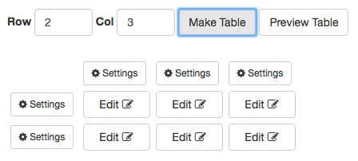

# InfoTown Table

## Summary

This program provides an easy way to make a table by intuitive User Interface.  
In the following example, it makes 2 rows and 3 columns table.

本プログラムは直感的なインターフェースでテーブルを作成します。  
2行3列を例に使い方を説明します。

### (1) Make table schema. 

You input 2 to Row area and input 3 to Col area.

Row入力域へ2、列入力域へ3を入力します。

You click "Make Table" button, then 2 rows and 3 columns table schema is made.

"Make Table"ボタンをクリックすると2行3列のテーブルが作成されます。

### (2) Input data to cell.

You click "Edit" button, then Edit data dialog is shown.
In the following example, You click first "Edit" button, then You input "This is sample" to text area and click "Save Data" button.

"Edit"ボタンをクリックして入力編集ダイアログを表示します。
下記例では最初の"Edit"ボタンをクリックし"This is sample"と入力し"Save Data"ボタンをクリックします。

Cells to which the data has been entered changes to orange color.

データを入力されているセルはオレンジ色で表示されます。

In the following example, All cell is filled with data.

下記は全てのセルへデータが入力されている例です。

### (3) Preview Table.

You click "Preview Table" button.

"Preview Table"ボタンをクリックします。

### (4) Save data to database.

Just click the "Save Data" button data has not yet been saved to the database .  
When "Save" button that is blue button is clicked, Data will be saved to the database.

"Save Data"をクリックしただけではデータはデータベースへ保存されません。  
青色の"Save"ボタンをクリックするとデータがデータベースへ保存されます。

### (5) Edit data.

In the following example, You edit second cell data.  
You click second "Edit" button then edit dialog is shown.

下記例で2番目のセルを編集します。
2番目の"Edit"ボタンをクリックすると編集ダイアログが表示されます。

In the following example, to change the text from "This is sample data2." to "This is edit data2.".

下記例はテキストを"This is sample data2."から"This is edit data2."へ変更します。

When You click "Preview Table" button, The changes are reflected.

"Preview Table"ボタンをクリックすると、変更が反映されいます。

You click "Save" button (blue button), then the changes will be saved to the database.

"Save"ボタン(青色)をクリックすると変更がデータベースへ保存されます。

### Modify schema(Context Menu)

You click "settings" button, then context menu is shown.

* Add Row  
  Insert row before of the current row.  
  行を現在の行の前に挿入します。
* Del Row  
  Delete current row.  
  現在の行を削除します。
* Add Col  
  Insert column before of the current column.  
  列を現在の列の前に挿入します。
* Del Col  
  Delete current column.  
  列を現在の列の後に挿入します。
* TH  
  Convert data type to TH (Table Header).  
  TH (Table Header)へ変更します。
* TD  
  Convert data tape to TD (Table Data).  
  TD (Table Data)へ変更します。
* Close  
  Close context menu.  
  コンテキストメニューを閉じます。

### Data status.

* Data is Filled.  
  データが入力済みの状態です。  

* Data is empty.  
  データがみ入力の状態です。  

* Data is TH (Table Header).  
  Label "Edit"  is italic.  
  THは"Edit"ラベルがイタリックになります。
* Data is TD (Table Data).  
  Label "Edit" is not italic.  
  TDは"Edit"ラベルがノーマルです。

