# Infotown Table manual

* [English version](#en)
* [日本語版](#ja)

## <a name="en">English</a>

### Summary

This intuitive User Interface makes it easy to create tables.

### Create/Edit/Preview/Output table

In the following example a table with 2 rows and 3 columns is created.

#### (1) Create table schema. 

Enter '2' in the 'Row' and '3' in the 'Col' fields.

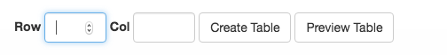

Click the 'Create Table' button to continue to the table.

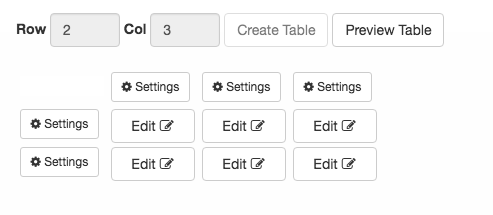

#### (2) Input data to cell.

Use the 'Edit' buttons to change the content of the cells.

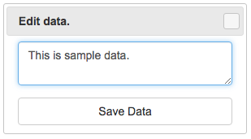

Cells to which the data has been entered changes to orange color.

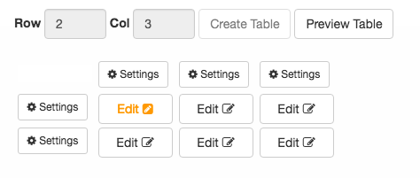

In the following example, All cells have data. 

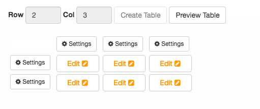

#### (3) Preview Table.

Click on 'Preview Table' to see the results.

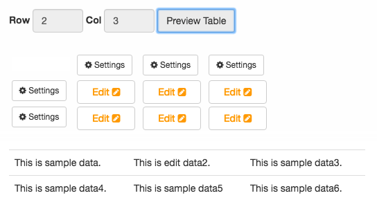

#### (4) Save the table.

Just click the 'Save Data' button data has not yet been saved to the database .  
When 'Save' button that is blue button is clicked, Data will be saved to the database.

#### (5) Edit data.

You can edit the data by using the 'Edit' buttons again.

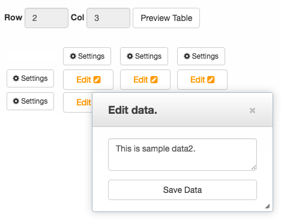

In the following example, to change the text from "This is sample data2." to "This is edit data2.".

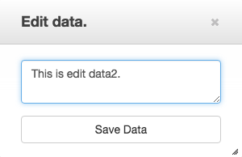

When You click 'Preview Table' button, The changes are reflected.

You click 'Save' button (blue button), then the changes will be saved to the database.

#### (6) Output table.

Suppose you made 2 rows and 3 columns table such as a following.

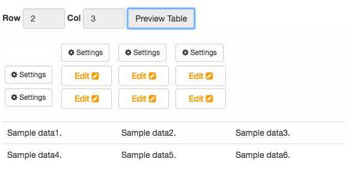

This program will output the table as shown below to the visitors.

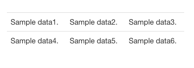

If you are using the elemental theme, it would look like below.

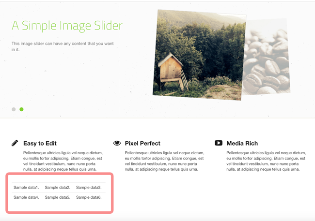

#### (7) Modify schema(Context Menu)

The 'Settings' button will give you the following context menu.

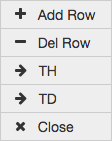

* Add Row  
  Insert row before of the current row.  
* Del Row  
  Delete current row.  
* Add Col  
  Insert column before of the current column.  
* Del Col  
  Delete current column.  
* TH  
  Convert data type to TH (Table Header).  
* TD  
  Convert data tape to TD (Table Data).  
* Close  
  Close context menu.  

### Data status.

* Data is Filled.  
  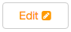
* Data is empty.  
  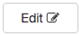
* Data is TH (Table Header).  
  Label "Edit"  is bold.  
* Data is TD (Table Data).  
  Label "Edit" is not bold.  

## <a name="ja">日本語</a>

### 概要

本プログラムは直感的なインターフェースでテーブルを作成します。  

### テーブル作成/編集/プレビュー

2行3列を例に使い方を説明します。

#### (1) テーブル構成作成

Row入力域へ2、列入力域へ3を入力します。

"Create Table"ボタンをクリックすると2行3列のテーブルが作成されます。

#### (2) データ入力

セルの内容を編集するには'Edit'ボタンを使います。

データが入力済みのセルはオレンジ色で表示されます。

下記は全てのセルへデータが入力されている例です。

#### (3) テーブルプレビュー

'Preview Table'ボタンをクリックします。

### (4) データ保存

'Save Data'をクリックしただけではデータはデータベースへ保存されません。  
青色の'Save'ボタンをクリックするとデータがデータベースへ保存されます。

### (5) データ編集

データの編集は'Edit'ボタンを再度クリックします。

下記例はテキストを'This is sample data2.'から'This is edit data2.'へ変更します。

'Preview Table'ボタンをクリックすると、変更が反映されいます。

'Save'ボタン(青色)をクリックすると変更がデータベースへ保存されます。

#### (6) テーブル表示.

下記のような2行3列のテーブルを作成したとします。

テーブルは閲覧者へ下記ように表示されます。

次の図はelementalテーマを選択しているときの例です。

#### (7) テーブル構成変更(メニュー)

行、列の先頭にある'Settings'ボタンをクリックするとメニューが表示されます。

* Add Row  
  行を現在の行の前に挿入します。
* Del Row  
  現在の行を削除します。
* Add Col  
  列を現在の列の前に挿入します。
* Del Col  
  列を現在の列の後に挿入します。
* TH  
  TH (Table Header)へ変更します。
* TD  
  TD (Table Data)へ変更します。
* Close  
  コンテキストメニューを閉じます。

### データ種別

* データが入力済みの状態です。  
  
* データが未入力の状態です。  
  
* TH (Table Header)は"Edit"ラベルが太字になります。
* TD (Table Data)は"Edit"ラベルがノーマルです。
